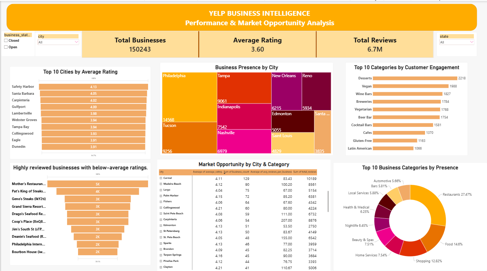

# Yelp Business Intelligence: Performance & Market Opportunity Analysis

An end-to-end data analytics project using Python, SQL Server, and Power BI to analyze business performance, customer engagement, market structure, and city-category opportunities using Yelp business data.

## Business Problem

Yelp contains information on businesses, ratings, and customer reviews across different cities and business categories. However, raw business data does not directly reveal where business activity is concentrated, which categories attract stronger customer engagement, or where potential market opportunities exist.

This project uses data analytics to transform the Yelp business dataset into actionable insights by examining market presence, customer engagement, business performance, and city-category opportunities.

## Project Objectives

- Analyze business distribution across cities and categories.
- Identify cities with strong average business ratings.
- Measure customer engagement using review activity.
- Identify high-performing businesses and businesses with high review volume but lower ratings.
- Identify highly rated businesses with relatively low review visibility.
- Identify city-category combinations with strong ratings and customer engagement as potential market opportunities.
- Develop an interactive Power BI dashboard to communicate the findings.

 ## Business Questions

### Market Analysis
1. Which cities have the highest number of businesses?
2. Which cities have the highest average rating?
3. Which cities have the highest customer engagement based on review volume?
4. Which cities have high business concentration but relatively low customer engagement?

### Category Analysis
5. Which business categories have the largest business presence?
6. Which categories have the highest average rating?
7. Which categories generate the highest review volume?
8. Which categories combine strong ratings with strong customer engagement?

### Business Performance
9. Which businesses are the top performers?
10. Which highly reviewed businesses have below-average ratings?
11. Which businesses have high ratings but relatively low review volume?

### Market Opportunity
12. Which city-category combinations show the strongest business opportunity?

## Dataset

The project uses the **Yelp Open Dataset**, focusing on the Business dataset.

The analysis uses business-level information including:

- Business ID
- Business name
- Address
- City
- State
- Postal code
- Latitude and longitude
- Star rating
- Review count
- Business open/closed status
- Business categories

### Data Preparation

The raw business data was processed using Python and Pandas before loading it into SQL Server.

Key preparation steps included:

- Handling records with missing business categories.
- Standardizing whitespace in text fields.
- Creating a business status field from the `is_open` indicator.
- Normalizing business categories.
- Creating a category dimension and business-category relationship table.
- Validating business IDs, ratings, review counts, and status values.
- Checking row counts and data consistency before SQL analysis.

  ### Data Integration & Connectivity

The project demonstrates data integration across multiple analytics platforms:

- **Kaggle API → Python:** Connected to the Kaggle API to programmatically acquire the Yelp dataset.
- **Python → SQL Server:** Connected Python to SQL Server using SQLAlchemy and PyODBC to load cleaned and transformed datasets.
- **SQL Server → Power BI:** Connected Power BI to SQL Server analysis views for interactive reporting and visualization.
  

### Final Analytical Dataset

| Dataset | Records |
|---|---:|
| Business | 150,243 |
| Category | 1,311 |
| Business-Category Relationships | 668,549 |

### Data Source

Yelp Open Dataset:  
https://www.kaggle.com/datasets/yelp-dataset/yelp-dataset

## Tools & Technologies

| Area | Tools |
|---|---|
| Data Acquisition | Kaggle API |
| Data Preparation | Python, Pandas, NumPy |
| Database | Microsoft SQL Server |
| SQL Analysis | T-SQL, CTEs, Joins, Aggregations, Views |
| Data Visualization | Microsoft Power BI |
| Data Modelling | Power BI Data Model, DAX |
| Version Control | Git, GitHub |

## Project Workflow

**Data Acquisition → Data Preparation → SQL Database → Data Validation → Business Analysis → Power BI Dashboard → Business Insights**

## SQL Analysis

The cleaned datasets were loaded into Microsoft SQL Server for structured business analysis and validation.

The SQL analysis was organized into four analytical areas:

### Market Analysis
- Business concentration across cities and states
- Average business ratings by city
- Customer engagement based on review volume
- Markets with high business concentration but relatively low customer engagement

### Category Analysis
- Business presence by category
- Average rating by category
- Total review volume by category
- Categories combining strong ratings with strong customer engagement

### Business Performance
- Identification of top-performing businesses using rating and review volume
- Highly reviewed businesses with below-average ratings
- Highly rated businesses with relatively low review volume

### Market Opportunity
- Identification of city-category combinations with strong business presence, ratings, and customer engagement

### SQL Views

Three analytical views were created to support reporting and Power BI:

| SQL View | Purpose |
|---|---|
| `vw_Business_Analysis` | Business-level analysis and reporting |
| `vw_Category_Analysis` | Category-level performance and engagement analysis |
| `vw_Market_Opportunity` | City-category opportunity analysis |

## Power BI Dashboard

An interactive Power BI dashboard was developed to present the analytical results through an executive-level view of market presence, customer engagement, business performance, and market opportunities.

### Dashboard Components

- **KPI Cards**
  - Total Businesses
  - Average Rating
  - Total Reviews

- **Market Analysis**
  - Business Presence by City
  - Top 10 Cities by Average Rating

- **Category Analysis**
  - Top 10 Business Categories by Presence
  - Top 10 Categories by Customer Engagement

- **Business Performance**
  - Popular but Weak Businesses

- **Market Opportunity**
  - Market Opportunity by City & Category

### Interactive Features

- City, State, and Business Status slicers
- Interactive filtering across dashboard visuals
- SQL Server-connected Power BI reporting

## Dashboard Preview

